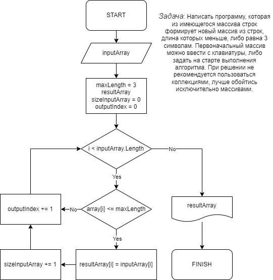

# Итоговоя контрольная работа #
## Задача: ##
Написать программу, которая из имеющегося массива из строк, длинна которохменьше либо равнв 3 символам.
Первоначальный массив можно ввести с клавиатуры, либо задать на старте выполнения аогоритма.

*При решении не рекомендуется пользоваться коллекциями, лучше обойтись исключительно массивами.* 

## Алгоритм решения представлен в виде Блок-схемы ##

## Программа ##

Программа запрашивает пользователя ввести значения через запятую.

Например: абракадабра, %@&, 1234, 321, fsdf, fd

Пример вывода программы: [абракадабра, %@&, 1234, 321, fsdf, fd] -> [%@&, 321, fd]

P.s. программа дополнительно учитывает случайно введенные лишние пробелы в начале или конце каждого введенного значения. Также программа дополнительно обрабатывает исключение, когда все ввдёные данные длиной больше 3 (трёх).

## Описание кода программы ##
1. Перебираем значения исходного массива.
2. Проверяем каждое знаение массва по очереди на соответствие условию: длинна строки меньше или равна трем (3).
3. Если условия выполняются выбранной строкой из исходного массива то данное значение кладем в новый массив.
4. Повторяем пункты 2 и 3 до тех пор пока не достигнем конца исходного массива.
5. Возращаем новый заполненый массив как результат.